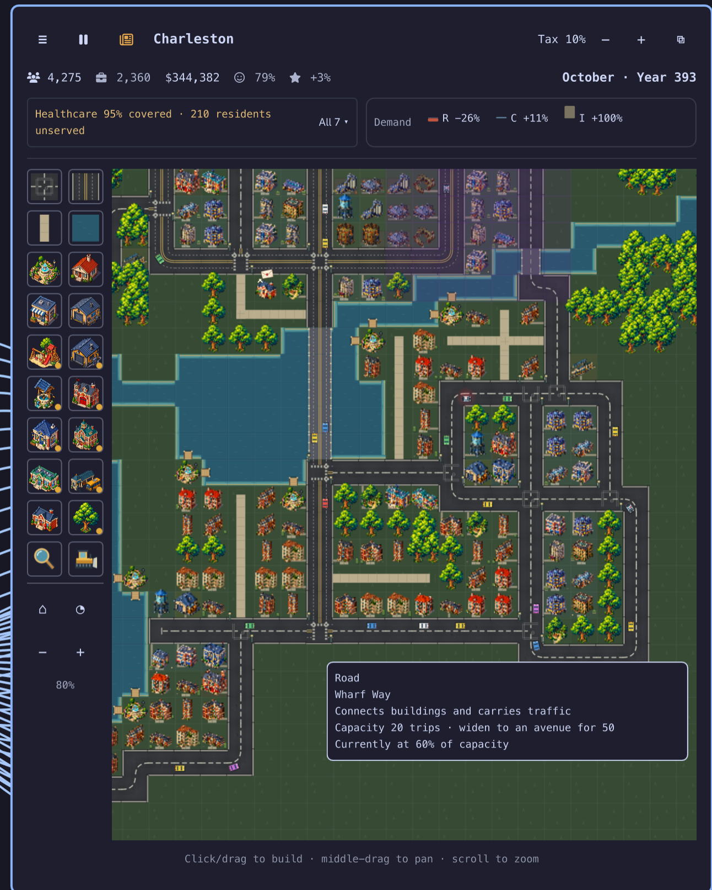

# Omaville

**A tiny city that grows in your Omarchy bar while you get on with your day.**

Zone a few roads, drop some houses, and go back to work. Omaville keeps ticking
in the background — a month every fifteen seconds — so by your next coffee there
are shops on the corner, somebody has written you a letter about the traffic, and
the local paper has opinions about how you're running the place.

Click the bar icon whenever you want to look in. Close it and the city carries on
without you.



## Get it

```bash
omarchy plugin add https://github.com/keithnyc/omaville --enable
```

Then add the Omaville widget to your bar in the Omarchy bar settings, click it,
and lay a road. Everything grows from there.

## What's in it

- 🏙️ **A city that plays itself while you work.** Zoned lots beside a road grow
  on their own when there's demand and people are happy. You plan; the city
  builds.
- 🎨 **Pixel art, three tiers deep.** Every family — houses, shops, factories,
  schools, stations — has its own look at every level, with at least two
  variants each and eight at the top tier, so no street repeats itself.
- 🚦 **Traffic that's a real puzzle.** Roads carry only so many trips, and the
  three fixes are ranked on purpose: zone shops near homes so fewer trips
  happen, lay a proper grid so they spread out, or pay to widen a street.
  Planning always beats spending.
- 🚌 **Buses, trams and transit hubs** for when planning runs out, plus 13
  city-wide ordinances — carpool, telecommuting, road tolls and the rest. Every
  one of them costs you something; none is a free win.
- 🔌 **Power, water, fire, police, medical and schools**, each covering a radius
  and billing you monthly per resident served — so services scale with your city
  instead of being a one-off purchase.
- 🔥 **Fires that spread and crime waves that settle in.** Engines drive the same
  streets everyone else does, so a gridlocked city burns longer. That's the
  whole design: every system reaches into the others.
- 💌 **Residents with names, jobs and opinions.** They age on their own slower
  clock, ask you for things you can actually go and build, warm to you when you
  deliver, and get a memorial statue if you were close.
- 📰 **The Charleston Gazette**, or whatever your city ends up called — covering
  milestones, fires, arrivals, departures and the occasional editorial at your
  expense.
- 🤔 **Dilemmas with no clean answer**, 46 of them, and none repeats until the
  rest have had a turn.
- 🏘️ **Four neighbouring towns** that grow whether you're watching or not.
  Connect a road for trade, migration and commerce — and for a rival big enough
  to squeeze your shops until you outgrow them.
- 💰 **An economy with a bottom to it.** Taxes on homes *and* business, municipal
  loans, department funding sliders, elections every four years that you can
  lose without losing the city.
- 🎯 **A long goal.** Surplus budget, full coverage, flowing traffic, contented
  residents, no debt — hold all of it for 24 straight months and your city is
  self-sustaining. The streak resets the moment any of it slips.
- 🪟 **Detach it into a real window** when you want to sit and play properly,
  then send it back to the bar.
- 🔒 **No network, no telemetry, no accounts.** One JSON file on your disk.

## A few things that make it tick

**The tax slider is a choice, not a dial.** Business is taxed too — commercial
jobs at 80% of a resident's rate, industrial at 50% — while your staffed
departments bill per resident. So a low-tax city earns more from shops than from
housing, and a high-tax one the other way round. Same slider, different city.

**Schools gate your skyline.** A *civic level* rises while your schools actually
reach people and stay funded, and falls when either lapses. Elementary supports
tier 2; only a university supports tier 3. It gates what you can build, never
what already stands — but let the schools slide and the top tier locks again.

**It doesn't cheat while you're away.** The simulation runs on the shell's clock
and stops when you go idle, so a suspended laptop loses nothing and a city you
haven't touched in a week hasn't secretly grown into a metropolis either.

**Requests belong to people, not to paperwork.** A resident's request lives on
the resident, so you can bin your entire mailbox without cancelling a single
thing anybody asked for.

## Where your city lives

`~/.local/state/omarchy/omaville-state.json` — the whole thing, one file. Safe to
delete if you'd like to start over, safe to copy if you'd like to keep one.

## Dependencies

`omarchy-notification-send`, from Omarchy itself, for milestone and budget
notifications. No network access and no other external commands.

## Development

See [DEVELOPING.md](DEVELOPING.md) for the layout, the two clocks, the save
format, and how to run the tests — there are 45 of them plus a QtQuick suite, and
`tools/run-tests.sh` runs the lot.

## License

MIT — see [LICENSE](LICENSE). Have fun with it.
